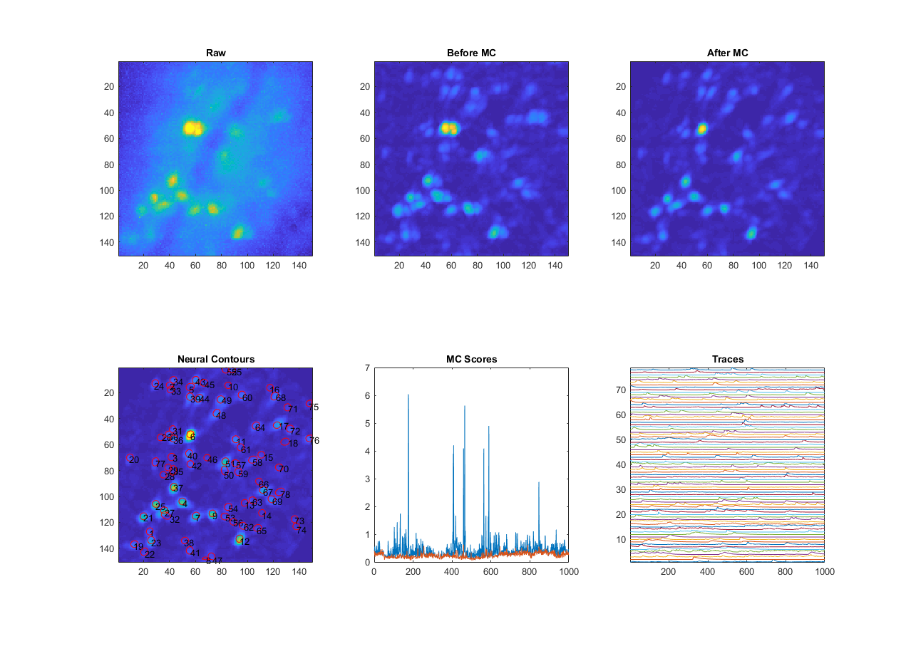

# MIN1PIPE
[A **MIN**iscope **1**-photon-based Calcium Imaging Signal Extraction **PIPE**line](https://www.biorxiv.org/content/early/2018/04/30/311548). 

MIN1PIPE is a fully automatic, Matlab-based toolbox, solving the full range problems in 1-photon calcium imaging in one package: *`data enhancement`* &rarr; *`movement morrection`* &rarr; *`signal extraction`*. It requires minimal parameter-tuning and integrates the semi-auto options. Each inidividual module can also be easily adapted for the 2-photon imaging setting.

## Contents
1. [Introduction and Features](#introduction-and-features)
2. [Dependencies](#dependencies)
3. [Usage](#usage)
4. [Dataset](#dataset)
5. [Custom Data](#custom-data)
6. [Practical Suggestions](#practical-suggestions)
7. [References](#references)
8. [Updates](#updates)
9. [Questions](#questions)

## Introduction and Features
MIN1PIPE contains the following three modules:
- **`Neural Enhancing`**: remove spatial noise and then adaptively remove non-neural background in the field of view in a framewise manner.
- **`Movement Correction`**: remove field of view movement with a specially designed hierarchical nonrigid movement correction module (integrating KLT Tracker and LogDemons deformation registration method), which is free of assumption about movement type and amplitude.
- **`Neural Signal Extraction`**: identify neuronal ROIs and corresponding calcium traces with minimal false positive rates (incorporating GMM, LSTM as true neuron selector and modified CNMF as spatiotemporal calcium signal identifier)

**Additional Features**
- **`Semi-auto options`**: we also provide semi-auto options, including
  - Automated manual seeds selection module: for users who want to manually select seeds of neuron ROIs that will result in **ZERO** false positives
  - Post-process exclusion of "bad" neural components
- **`RNN-LSTM classifier training module`**: we provide a module of Recursive Neural Network (RNN) with Long-short Term Memory (LSTM) structure fully implemented in Matlab with which the users can train their specific calcium-dynamical classifier. 

## Dependencies
This Matlab implementation has the following dependencies (included under [`utilities`](./utilities)):
- Modified [CNMF](https://github.com/flatironinstitute/CaImAn-MATLAB)
    - [CVX](http://cvxr.com/cvx/): for OS other than Windows, users should download correpsonding CVX toolbox and replace the folder CVX in the codes.

**Additional Matlab toolboxes**:
- Computer Vision System Toolbox
- Curve Fitting Toolbox
- Fuzzy Logic Toolbox
- Image Processing Toolbox
- Optimization Toolbox
- Parallel Computing Toolbox
- Signal Processing Toolbox
- Statistics and Machine Learning Toolbox
- Symbolic Math Toolbox

Other modified functions adapted from others are credited the original sources in code documentations.

## Usage
- **Do not add the package to the Matlab path before running, the package will add everything automatically.**
- Download/clone the git repository of the codes
- Open Matlab and set the MIN1PIPE folder as the current folder in Matlab
- Run [`min1pipe.m`](./min1pipe.m).
    - The code automatically sets the package to the path, and processes the data the user specifies. 
    - For argument options, please see [`min1pipe.m`](./min1pipe.m)
- The only manual intervention is to select the data for processing. 
    - A modal dialogue is popped up right after the execution of the code, and the users can select the folder containing the data.
    - For multi-video datasets automatically divided by the data acquisition softwares, only the first (or a random video of the session) needs choosing. 
    - The algorithm will automatically judge the format of the datasets.
    - Currently support: *.avi*, *.tif* and *.tiff*.

**Key Parameters**:
- **`Fsi`**: frame rate of original video
- **`Fsi_new`**: frame rate of temporally downsampled video
- **`spatialr`**: spatial downsampling rate
- **`se`**: structure element size, estimated from typical half-neuron size after spatial downsampling

**Procedure Parameters**:
- **`ismc`**: whether use movement correction module
- **`flag`**: whether use automatic or semi_automatic seeds selection
- **`isvis`**: whether visualize after processing, including results of each step
- **`ifpost`**: whether use post-process

**Key Outputs**:
- **`roifn`**: processed vectorized ROI footprints
- **`sigfn`**: processed calcium traces of corresponding ROIs
- **`roifnr`**: processed vectorized ROI footprints without calcium deconvolution
- **`sigfnr`**: processed calcium traces without calcium deconvolution, meaning "no artificial cleaning"
- **`seedsfn`**: ROI centers in pixel coordinates
- **`Params`**: used parameters
- **`reg`**: data after neural enhancing (and movement correction), saved for reprocessing

Other fixed preset parameters can be found in [`min1pipe.m`](./min1pipe.m), and the **`table`** in the [paper](https://www.biorxiv.org/content/early/2018/04/30/311548).

## Dataset
As a demo, we demonstrate the use of 1-photon calcium imaging video recorded with [UCLA miniscope](http://miniscope.org/index.php/Main_Page):
```
demo_min1pipe.m
```
The same code can also be adapted to custom scripts for the processing.

Here are the visualization of the demo dataset processing:



## Custom Data
To use the code on a custom dataset, no specific requirements are needed. The processed data and the data after movement correction are saved in the same folder of the raw data in *".mat"* format, with *"_data_processed"* and *"_reg"* as endings separately.

If post-process is selected, there will be an additional *".mat"* file created with *"_data_processed_refined"*.

## Practical Suggestions
***Updates***
***07/16/2018*** Patch version released. The program auto-detects available memory and processes data in chunk. Integrate fast read&write and memory mapping at key steps.

---

- Data tips
    - Data should be arranged in sessions.
    - Each session contains multiple videos automatically divided by the recording softwares.
    - For [Inscopix](https://www.inscopix.com/) data, data are divided and renamed with a pattern of adding "-" + *"indices"*. We suggest sticking to this format for *.tif* and *.tiff* data.
    - For [UCLA miniscope](http://miniscope.org/index.php/Main_Page), data are named with *"msCam"* + *"indices"*, and we suggest sticking to this format for *".avi"* data.
    - For best practice, remove apparent artifects such as bright edges of the grin lenses, even though the algorithm can handle these conditions.
    - For sessions with only a few neurons and possibly huge artifects/contaminations, semi-auto seeds selection can be considered at first hand.
- Software
    - Matlab R2017 and later.
- Hardware
    - Better hardwares are always preferred, for professional data analysis such as in the regular lab environment, even though the algorithms can be adapted to personal computers.
    - Typically, ~4 times of the size of a single session dataset (after downsampling) of memory is recommanded for processing.
    - Memory mapping will be integrated in future.
  
## References
***Updates***

Please cite [the MIN1PIPE journal paper](https://www.cell.com/cell-reports/fulltext/S2211-1247(18)30826-X) if it helps your research.
```
@article{lu2018MIN1PIPE,
  title={MIN1PIPE: A Miniscope 1-photon-based Calcium Imaging Signal Extraction Pipeline.},
  author={Lu, J., Li, C., Singh-Alvarado, J., Zhou, Z., Fröhlich, F., Mooney, R., & Wang, F.},
  journal={Cell reports},
  volume={23},
  number={12},
  pages={3673--3684},
  year={2018},
  publisher={Elsevier}
}
```
***Archives***

The paper is now *accepted* by *Cell Reports*.

Please cite [the MIN1PIPE paper](https://www.biorxiv.org/content/early/2018/04/30/311548) if it helps your research.
```
@article{lu2018MIN1PIPE,
  title={MIN1PIPE: A Miniscope 1-photon-based Calcium Imaging Signal Extraction Pipeline.},
  author={Lu, J., Li, C., Singh-Alvarado, J., Zhou, Z., Fröhlich, F., Mooney, R., & Wang, F.},
  journal={bioRxiv, 311548},
  year={2018}
}
```
or the related [arXiv version](https://arxiv.org/abs/1704.00793):
```
@article{lu2017seeds,
  title={Seeds Cleansing CNMF for Spatiotemporal Neural Signals Extraction of Miniscope Imaging Data},
  author={Lu, Jinghao and Li, Chunyuan and Wang, Fan},
  journal={arXiv preprint arXiv:1704.00793},
  year={2017}
}
```

## Updates


## Questions?
Please email to [`min1pipe2018@gmail.com`](mailto:min1pipe2018@gmail.com) for additional questions.
